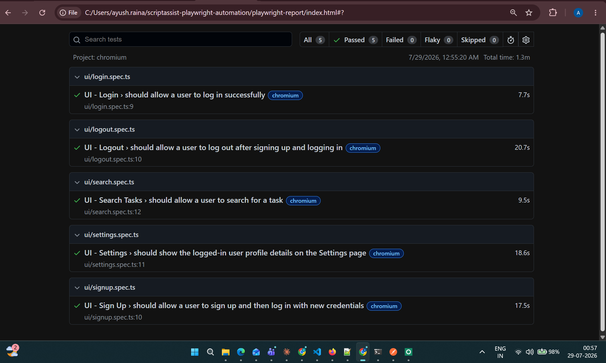
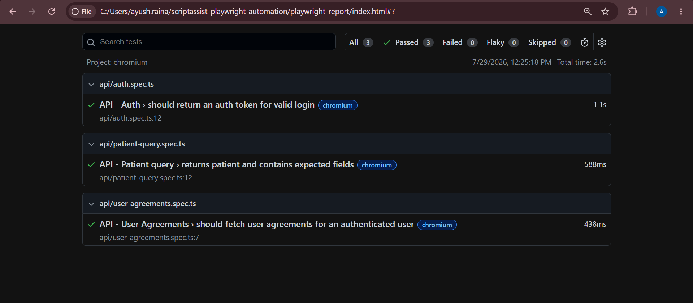

# Test Strategy

## Part A - Test Strategy

### 1. Which user journeys would you automate first, and why?

I would prioritize the application's critical business flows that users perform most frequently and that have the highest impact if they fail.

These include:
- User Login
- User Logout
- Dashboard loading
- Profile viewing/updating
- Settings update
- Authentication validation

These scenarios provide strong confidence that the application remains usable after deployment and help catch the most important regressions early.

### 2. Which scenarios would you include in a Smoke suite?

The Smoke suite should verify that the core functionality of the application is working.

I would include:
- Application launches successfully
- Valid user login
- Dashboard loads successfully
- Profile page opens
- Update profile (basic edit)
- Settings page accessible
- Logout functionality

These tests are fast, stable, and validate the application's most important workflows.

### 3. What would you intentionally not automate at this stage?

Initially, I would avoid automating:
- Visual/UI appearance testing
- Complex edge cases
- Rarely used workflows
- Third-party integrations
- CAPTCHA/MFA flows
- Accessibility testing (until dedicated tooling is added)

These require additional tooling or provide lower ROI during the initial automation phase.

## Part D - Engineering Decisions

### 1. Why did you structure your framework this way?

The framework follows the Page Object Model (POM) to separate test logic from UI interactions.

The structure provides:
- Better maintainability
- Reusable page methods
- Easier debugging
- Cleaner test files
- Scalability for future test additions

Utilities, fixtures, configuration, and test data are separated to keep responsibilities isolated.

### 2. How would you reduce flaky tests?

I would reduce flaky tests by:
- Using Playwright Locators instead of ElementHandles
- Relying on Playwright's built-in auto waiting
- Avoiding hard waits like `waitForTimeout`
- Waiting for meaningful UI states
- Using stable selectors
- Isolating test data
- Running tests independently

### 3. If this project grew to 500 tests, what would you improve first?

I would focus on:
- Better tagging (Smoke, Regression, Sanity)
- Parallel execution
- Reusable fixtures
- Test data management
- API setup instead of repetitive UI setup
- CI execution optimization
- Reporting dashboards
- Retry strategy only for known flaky tests

### 4. How would you execute these tests in CI/CD?

I would integrate the framework with a CI/CD pipeline such as GitHub Actions, Jenkins, Azure DevOps, or GitLab CI.

The pipeline would:
- Install dependencies
- Install Playwright browsers
- Execute linting
- Run Smoke tests on every Pull Request
- Run Regression tests nightly
- Generate HTML reports
- Upload screenshots, videos, and traces for failed tests
- Publish test reports as pipeline artifacts

## README Summary

### UI
- Covered through end-to-end Playwright tests for login, logout, search, settings, and signup.

### API
- Covered through API validation tests for authentication, patient queries, and user agreements.

## Assumptions Made

- The test environment is stable and accessible.
- Test accounts are available.
- Test data is independent and reusable.
- Stable locators are available.
- APIs required for authentication are functional.

## What I Would Improve With More Time

Given additional time, I would enhance the framework by:
- Implementing API-based authentication to reduce UI execution time
- Adding data-driven testing for broader input coverage
- Integrating Allure reporting with environment and execution metadata
- Introducing accessibility testing using Axe
- Adding visual regression testing for key screens
- Expanding API automation coverage
- Integrating code quality tools such as ESLint, Prettier, and Husky
- Supporting multiple environments through environment-specific configuration
- Running tests in parallel across multiple browsers in CI
- Incorporating performance monitoring into the automation pipeline
